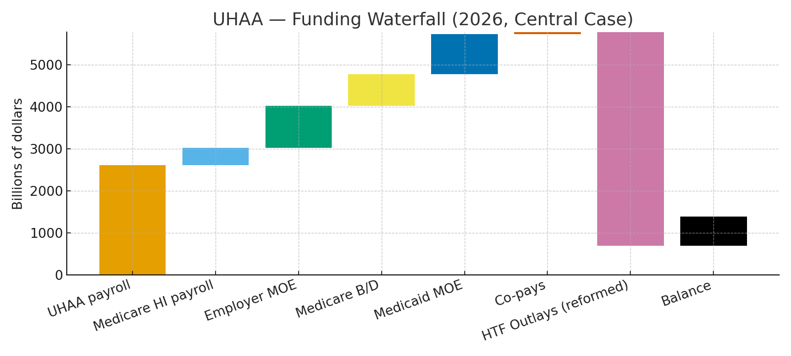

# UHAA Fiscal Appendix — Back-of-the-Envelope (Updated Model, 2026)

> **Scope:** 2026 steady-state snapshot with **core CPI** indexation for forward growth (does not change this single-year view). Figures in **billions**.

## Outlay Construction
Step | Amount
---|---:
Gross essential spend (85% × $5.9T) | $5,015B
Less: Admin efficiency | -$150B
Less: Insurer net income on essentials | -$30B
Less: Drug savings (base) | -$60B
Add: Rural bonus | +$75B
Add: Admin operations (~6%) | +$286B
Add: Innovation (1%) | +$48B
Add: Surge (2%) | +$95B
**HTF Outlays — Base** | **$5,279B**
Less: Reform savings (site-neutral + global budgets + extra drug) | -**$190B**
**HTF Outlays — Reformed** | **$5,089B**

## Inflow Construction (Central Case; Employee = 7%)
Component | Amount
---|---:
UHAA payroll (employer doubled + employee 7%) | $2,617B
Medicare HI payroll (rolled into HTF) | $413B
Employer MOE (7.5% of payroll) | $998B
Medicare Parts B/D (general revenue redirection) | $750B
Medicaid MOE (federal + state) | $950B
Co-pays (microsim, after 5%-of-AGI caps) | $55B
**Total Inflows — Central** | **$5,783B**

## Base Pro-Forma
|  | Amount |
|---|---:|
| **Total Inflows** | **$5,783B** |
| **HTF Outlays — Reformed** | **$5,089B** |
| **Balance (Inflows − Outlays)** | **$694B** |

## Funding Waterfall — 2026 Central Case
The chart shows how each inflow component stacks up against total reformed outlays, leaving the net balance.

---
**Notes:**
- Core CPI indexation applies to payment growth caps and automatic adjusters for years beyond 2026.
- Trust-fund assets (Medicare HI) are a one-time balance-sheet infusion and not included here as annual flow.
- Reform savings reflect: site-neutral payments (~$60B/yr), all-payer global hospital budgets (~$90B/yr), expanded drug negotiation (~$40B/yr).
