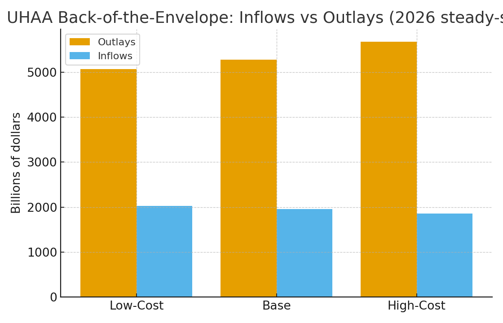

# UHAA Fiscal Appendix — Back‑of‑the‑Envelope (Markdown)

> **Scope:** Illustrative steady‑state view (circa 2026) to size the order of magnitude for the Universal Healthcare Access Act (UHAA). Figures are in **billions of dollars** unless noted. Assumptions use the **latest federal sources** and are noted inline.

## Anchors from Public Data
- **National Health Expenditures (NHE), 2026:** ~**$5.9T** (CMS Office of the Actuary; summarized by Peterson‑KFF).
- **Wage & Salary Disbursements (Payroll Base) 2025 Q2 SAAR:** **$12,945B** (BEA via FRED). Conservatively **+2.8%** to 2026 ⇒ **$13,308B** payroll base.

**Citations:** CMS NHE Projections (2024–2033) and KFF summary; BEA/FRED WASCUR series. See sources list at the end.

## Core Policy Levers from UHAA
- **Average effective payroll contribution:** **9.5%**
- **Essential services share of NHE covered by HTF:** **85%**
- **Administrative ops (within ≤7% cap):** target **6%** (scenario range 5.5%–7.0%)
- **Innovation & Surge set‑asides:** **1%** and **2%** of outlays, respectively
- **Rural bonus:** **+10%** on an estimated **15%** of services

## Assumptions for Inflows
- **Payroll contributions:** $1,264B
- **Redirected federal health spending to HTF (Medicaid federal share + ACA subsidies):**
  - Low: $550B | Base: $650B | High: $725B
- **Net co‑pay receipts (after waivers and 5%‑of‑AGI caps):** $40B

## Assumptions for Outlays & Savings
- **Essential gross outlays proxy (85% × NHE):** $5,015B
- **Administrative efficiency savings (~3% of essential):** $150B
- **Drug savings (complements IRA negotiation):** Base $60B (range 40–80)
- **Eliminated insurer net income on essentials:** $30B
- **Rural bonus cost (10% uplift on 15% of essential):** $75B

## Scenario Table
Scenario | Outlays | Inflows | Payroll | Redirected | Co‑pays | Balance
---|---:|---:|---:|---:|---:|---:
Low-Cost | $5,071B | $2,029B | $1,264B | $725B | $40B | $-3,041B
Base | $5,279B | $1,954B | $1,264B | $650B | $40B | $-3,325B
High-Cost | $5,680B | $1,854B | $1,264B | $550B | $40B | $-3,826B

## Notes & Caveats
- **Not a formal score.** These are directional magnitudes to inform drafting.
- **Utilization effects.** Low/High scenarios apply −3% / +6% utilization shifts to essential spending, consistent with CMS commentary about coverage and price effects in 2026–27.
- **Redirected funds.** Base assumes ~$650B redirection of federal Medicaid and ACA subsidies into HTF; see CBO/CRS/KFF for baseline context; policy changes in 2025 laws may alter future baselines.
- **Payroll base.** Based on BEA Q2‑2025 SAAR wages with a modest step‑up to 2026; change this growth rate to sensitivity‑test revenue.
- **Set‑asides.** Innovation (1%) and Surge (2%) are internal to outlays; unused surge funds roll forward.

## Sources
- **CMS Office of the Actuary** — *National Health Expenditure Projections, 2024–2033: Forecast Summary* (June 25, 2025) and Projected NHE page.
- **Peterson‑KFF Health System Tracker** — “How much is health spending expected to grow?” (Aug. 4, 2025) — cites **$5.9T** NHE in 2026.
- **BEA via FRED (WASCUR)** — *Compensation of Employees: Wages and Salary Accruals*, Q2 2025 **$12,945B** SAAR; used for payroll base.
- **CRS & CBO coverage notes** — CRS on enhanced PTC expiration (R48290, Sept. 24, 2025); CBO/CMS discussions on 2026 enrollment and spending dynamics.
