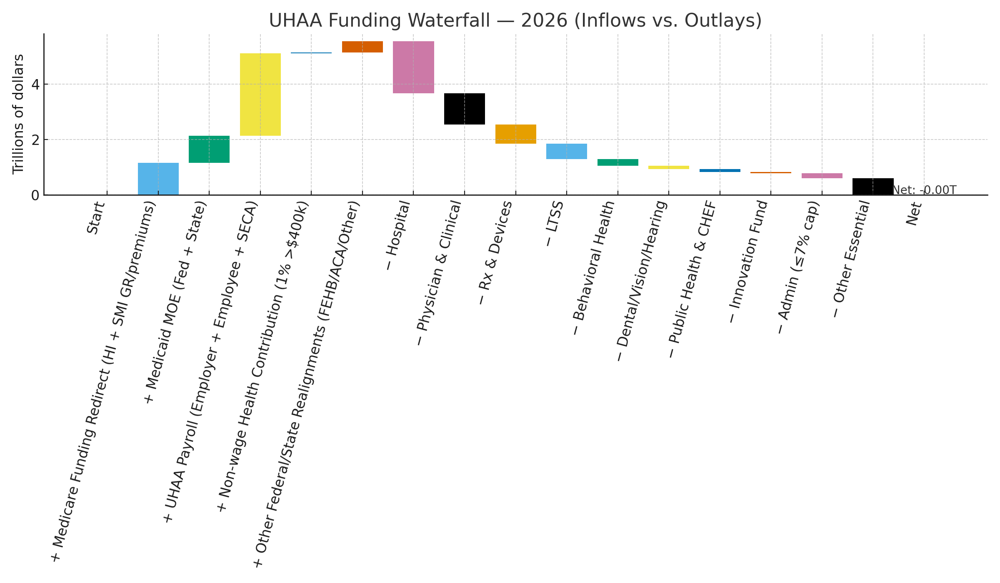
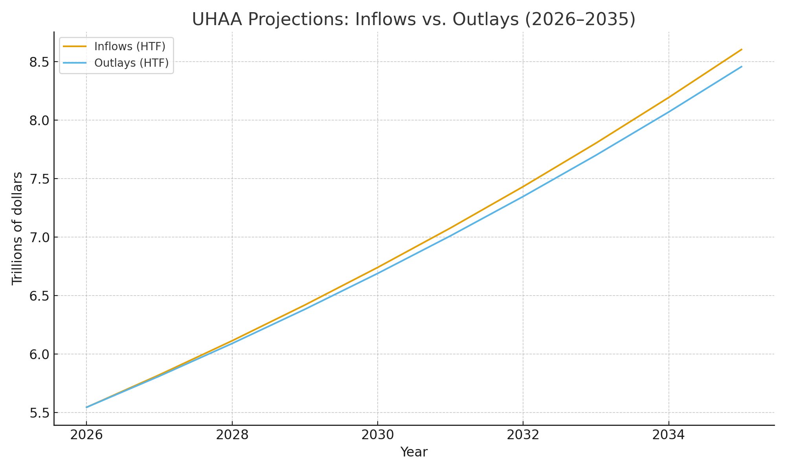

# Universal Healthcare Access Act of 2026 (UHAA) — One‑Pager

> A fiscally balanced, hybrid single‑payer that guarantees essential care for everyone, reins in prices, and preserves choice.

---

## What UHAA Does
- **Universal coverage** for essential services (modeled on Medicare benefits) for **all** citizens and lawful residents; non‑residents billed at cost + admin.
- **Hybrid model:** keep **supplemental private insurance** and **HSAs** for non‑essential services and amenities.
- **Free choice of providers:** no networks, no prior auth for essentials; telemedicine covered at parity (80% of in‑person reimbursement).

## How It’s Paid For (Four Pillars)
1. **UHAA Payroll** — employer **doubled** share (≈12.67% effective) + employee **5%–9.5%** band (floor at 105% FPL; cap 9.5%).  
2. **Medicare Realignment** — **HI payroll** + **Parts B/D general revenues** redirected to the HTF.  
3. **Medicaid MOE** — federal & state maintenance‑of‑effort dollars into the HTF.  
4. **Employer MOE** — replaces premiums: **≥7.5% of payroll** or prior‑year health spend (inflation‑adjusted).

> **Indexation:** Payment updates, caps, and automatic triggers are tied to **Core CPI** (not CPI‑M).

## Progressive Co‑Pays (OOP cap = 5% of AGI)
- **Low‑income**: $0 for essentials except modest ER/ambulance/hospital/day and $10 Rx;  
- **Middle**: PC $20, Specialist $50, Rx $20, Labs $10, ER $100;  
- **High / Very‑High**: **2× / 3×** middle co‑pays;  
- **Annual OOP** capped at **5% of AGI** (auto‑refunded above cap).

## Cost Controls (Built‑In)
- **All‑payer global hospital budgets** with growth cap **Core CPI + 0.5pp**.  
- **Site‑neutral** payments; facility‑fee limits for outpatient, imaging, labs, telehealth.  
- **HTF‑wide drug negotiation** (class‑based, cost‑plus, international reference pricing).  
- **Admin cap ≤7%**; AI‑assisted anti‑fraud with human oversight.

## 2026 Fiscal Snapshot (billions)
|  | Amount |
|---|---:|
| **HTF Outlays (reformed)** | **$5,089** |
| **Total Inflows (central, employee 7%)** | **$5,783** |
| **Balance** | **+$693** |

**Funding mix (2026, billions):** UHAA payroll **$2,617**, Medicare HI payroll **$413**, Employer MOE **$998**, Medicare B/D **$750**, Medicaid MOE **$950**, Co‑pays **$55**.  
See the **funding waterfall**: 

## Multi‑Year Path (core‑CPI caps)
- With outlays growing at **Core CPI + 0.5pp** and payroll base at ~**4.5%**/yr, the model shows **ongoing annual surpluses**.  
- 2026–2033 projection & lines chart available: 

## Transition (Years 1–5)
- **Year 1:** Stand up HTF & Portal; publish site‑neutral schedule; pilot hospital budgets.  
- **Year 2:** Consolidate Medicare (HI + Parts B/D) into HTF; begin national global budgets; Employer MOE at **5%**.  
- **Years 3–4:** Raise Employer MOE to **7.5%**; complete Medicaid MOE; phase in mental health & vision parity.  
- **Years 2–5:** Phase out private insurance for essentials; preserve supplemental markets.

## Links
- **Full updated bill (Markdown):** [UHAA Bill Text](Bill_Text.md)
- **Back‑of‑the‑envelope appendix + waterfall:** [Financial Model - Back of Envelope](Financial%20Modeling/UHAA_BOTE_updated_with_waterfall.md)
- **Microsim + re‑modeled financials:** [Simulation and Reformed Model Financials](Financial%20Modeling/UHAA_microsim_and_reform_financials.md)

